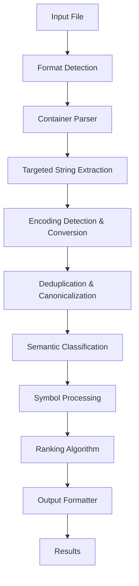

# Design Document

## Overview

Stringy implements a format-aware string extraction system that leverages deep knowledge of file structures to distinguish legitimate strings from binary noise. The architecture follows a pipeline approach: format detection → targeted extraction → semantic classification → ranking → output formatting. The system is designed for extensibility through feature gates while maintaining high performance through memory mapping and lazy evaluation.

## Architecture

### High-Level Flow



### Core Architecture Principles

1. **Format-First Approach**: Every extraction decision is informed by file format knowledge
2. **Lazy Evaluation**: Optional features (DWARF, disassembly) are computed only when needed
3. **Memory Efficiency**: Use memory mapping for large files, streaming processing where possible
4. **Extensible Design**: Plugin architecture for new file formats via feature gates
5. **Performance-Conscious**: Cache compiled regexes, minimize allocations in hot paths

## Components and Interfaces

### 1. Container Detection & Parsing (`src/container/`)

**Purpose**: Detect file format and extract structural metadata needed for intelligent string extraction.

```rust
pub trait ContainerParser {
    fn detect(data: &[u8]) -> bool;
    fn parse(&self, data: &[u8]) -> Result<ContainerInfo, ParseError>;
}

pub struct ContainerInfo {
    pub format: BinaryFormat,
    pub sections: Vec<SectionInfo>,
    pub imports: Vec<ImportInfo>,
    pub exports: Vec<ExportInfo>,
    pub resources: Vec<ResourceInfo>,    // PE-specific
    pub load_commands: Vec<LoadCommand>, // Mach-O specific
}

pub struct SectionInfo {
    pub name: String,
    pub offset: u64,
    pub size: u64,
    pub rva: Option<u64>,
    pub section_type: SectionType,
    pub is_executable: bool,
    pub is_writable: bool,
}

pub enum SectionType {
    StringData,   // .rodata, .rdata, __cstring
    ReadOnlyData, // .data.rel.ro, __DATA_CONST
    WritableData, // .data
    Code,         // .text, __TEXT
    Debug,        // .debug_*, __DWARF
    Resources,    // PE resources
    Other,
}
```

**Implementation Strategy**:

- Use `goblin` as primary parser for ELF/PE/Mach-O detection and basic parsing
- Enhance with `pelite` for PE resource extraction (VERSIONINFO, STRINGTABLE)
- Use `object` crate for additional Mach-O load command parsing
- Each format gets its own module: `elf.rs`, `pe.rs`, `macho.rs`

### 2. String Extraction Engine (`src/extraction/`)

**Purpose**: Extract strings from format-appropriate locations using encoding-aware algorithms.

```rust
pub trait StringExtractor {
    fn extract_from_section(&self, data: &[u8], section: &SectionInfo) -> Vec<RawString>;
}

pub struct RawString {
    pub data: Vec<u8>,
    pub offset: u64,
    pub encoding: Encoding,
    pub confidence: f32,
}

pub enum Encoding {
    Ascii,
    Utf8,
    Utf16Le,
    Utf16Be,
}

pub struct ExtractionConfig {
    pub min_ascii_length: usize,
    pub min_wide_length: usize,
    pub enabled_encodings: Vec<Encoding>,
    pub section_weights: HashMap<SectionType, f32>,
}
```

**Key Algorithms**:

- **ASCII/UTF-8**: Scan for runs of printable characters (0x20-0x7E, plus common extended)
- **UTF-16LE**: Look for even-length sequences where low bytes are mostly printable and high bytes are mostly zero
- **UTF-16BE**: Similar but with byte order reversed
- **Null-interleaved detection**: Handle cases where UTF-16 appears as ASCII with null bytes

### 3. Classification System (`src/classification/`)

**Purpose**: Apply semantic tags and handle symbol demangling.

```rust
pub trait Classifier {
    fn classify(&self, text: &str, context: &StringContext) -> Vec<Tag>;
}

pub struct StringContext {
    pub section: Option<SectionInfo>,
    pub source: StringSource,
    pub surrounding_data: Option<&[u8]>,
}

pub enum StringSource {
    SectionData,
    ImportName,
    ExportName,
    ResourceString,
    LoadCommand,
    DebugInfo,
}

pub enum Tag {
    Url,
    Domain,
    IPv4,
    IPv6,
    FilePath,
    RegistryPath,
    Guid,
    Email,
    Base64,
    FormatString,
    UserAgent,
    Import,
    Export,
    Version,
    Manifest,
    Resource,
}
```

**Classification Strategy**:

- Use `regex` crate for pattern matching with pre-compiled patterns
- Use `aho-corasick` for fast multi-pattern matching of keywords
- Implement `rustc-demangle` integration for Rust symbol processing
- Cache compiled patterns globally to avoid recompilation

### 4. Ranking Algorithm (`src/classification/ranking.rs`)

**Purpose**: Score strings based on multiple factors to surface most relevant results first.

```rust
pub struct RankingEngine {
    section_weights: HashMap<SectionType, i32>,
    tag_boosts: HashMap<Tag, i32>,
    noise_detectors: Vec<Box<dyn NoiseDetector>>,
}

pub trait NoiseDetector {
    fn calculate_penalty(&self, string: &FoundString) -> i32;
}

// Score = SectionWeight + EncodingConfidence + SemanticBoost - NoisePenalty
pub fn calculate_score(string: &FoundString, config: &RankingConfig) -> i32;
```

**Scoring Components**:

- **Section Weight**: `.rodata`/`.rdata`/`__cstring` = +10, resources = +8, `.data` = +5, others = +0
- **Semantic Boost**: URL/GUID/registry = +5, paths/formats = +3, imports/exports = +2
- **Noise Penalty**: High entropy = -3, excessive length (>200 chars) = -2, repeated patterns = -1
- **Encoding Confidence**: UTF-8 = +1, clean UTF-16 = +2, mixed/uncertain = +0

## Data Models

### Core Data Structure

```rust
#[derive(Serialize, Deserialize, Debug, Clone)]
pub struct FoundString {
    pub text: String,
    pub encoding: Encoding,
    pub offset: u64,
    pub rva: Option<u64>,
    pub section: Option<String>,
    pub length: u32,
    pub tags: Vec<Tag>,
    pub score: i32,
    pub source: StringSource,
}

#[derive(Serialize, Deserialize, Debug)]
pub struct ExtractionResult {
    pub strings: Vec<FoundString>,
    pub metadata: ExtractionMetadata,
}

#[derive(Serialize, Deserialize, Debug)]
pub struct ExtractionMetadata {
    pub file_format: BinaryFormat,
    pub file_size: u64,
    pub sections_analyzed: Vec<String>,
    pub total_strings_found: usize,
    pub extraction_time_ms: u64,
}
```

## Error Handling

### Error Types

```rust
#[derive(Debug, thiserror::Error)]
pub enum StringyError {
    #[error("Unsupported file format")]
    UnsupportedFormat,

    #[error("File I/O error: {0}")]
    IoError(#[from] std::io::Error),

    #[error("Binary parsing error: {0}")]
    ParseError(String),

    #[error("Invalid encoding in string at offset {offset}")]
    EncodingError { offset: u64 },

    #[error("Configuration error: {0}")]
    ConfigError(String),
}

pub type Result<T> = std::result::Result<T, StringyError>;
```

### Error Recovery Strategy

- **Unsupported formats**: Graceful degradation to basic string extraction
- **Parsing errors**: Continue with partial results, log warnings
- **Encoding errors**: Skip malformed strings, continue processing
- **Memory errors**: Use streaming processing for large files

## Testing Strategy

### Unit Testing

```rust
// Test each component in isolation
#[cfg(test)]
mod tests {
    use super::*;

    #[test]
    fn test_ascii_extraction() {
        let data = b"Hello\x00World\x00\x01\x02\x03Test";
        let extractor = AsciiExtractor::new(4);
        let strings = extractor.extract(data);
        assert_eq!(strings.len(), 2);
        assert_eq!(strings[0].text, "Hello");
        assert_eq!(strings[1].text, "Test");
    }

    #[test]
    fn test_utf16_detection() {
        let data = b"H\x00e\x00l\x00l\x00o\x00\x00\x00";
        let extractor = Utf16Extractor::new(3);
        let strings = extractor.extract(data);
        assert_eq!(strings[0].text, "Hello");
        assert_eq!(strings[0].encoding, Encoding::Utf16Le);
    }
}
```

### Integration Testing

- **Binary fixtures**: Create test binaries for each supported format (ELF, PE, Mach-O)
- **End-to-end CLI tests**: Use `insta` for snapshot testing of CLI output
- **Performance benchmarks**: Use `criterion` for regression testing of critical paths
- **Cross-platform validation**: Test on Linux, macOS, Windows with different architectures

### Test Data Strategy

```text
tests/
├── fixtures/
│   ├── elf/
│   │   ├── simple_hello_world
│   │   ├── rust_binary_with_symbols
│   │   └── stripped_binary
│   ├── pe/
│   │   ├── hello_world.exe
│   │   ├── with_resources.exe
│   │   └── dotnet_assembly.exe
│   └── macho/
│       ├── hello_world_x64
│       └── universal_binary
├── integration/
│   ├── cli_tests.rs
│   ├── format_detection_tests.rs
│   └── output_format_tests.rs
└── benchmarks/
    ├── extraction_performance.rs
    └── large_file_handling.rs
```

## Performance Considerations

### Memory Management

- **Memory Mapping**: Use `memmap2` for read-only access to large files
- **Streaming Processing**: Process sections incrementally for very large binaries
- **String Interning**: Deduplicate common strings to reduce memory usage
- **Lazy Loading**: Only parse optional features (DWARF, resources) when requested

### Optimization Strategies

- **Regex Compilation**: Pre-compile and cache all classification patterns
- **Section Filtering**: Skip sections known to contain no strings (code, BSS)
- **Early Termination**: Stop processing when confidence thresholds aren't met
- **Parallel Processing**: Use rayon for independent section processing

### Scalability Targets

- **File Size**: Handle files up to 1GB efficiently
- **String Count**: Process binaries with 100K+ strings without performance degradation
- **Memory Usage**: Peak memory usage should not exceed 2x file size
- **Processing Time**: Complete analysis of typical binaries (10-50MB) in under 1 second
