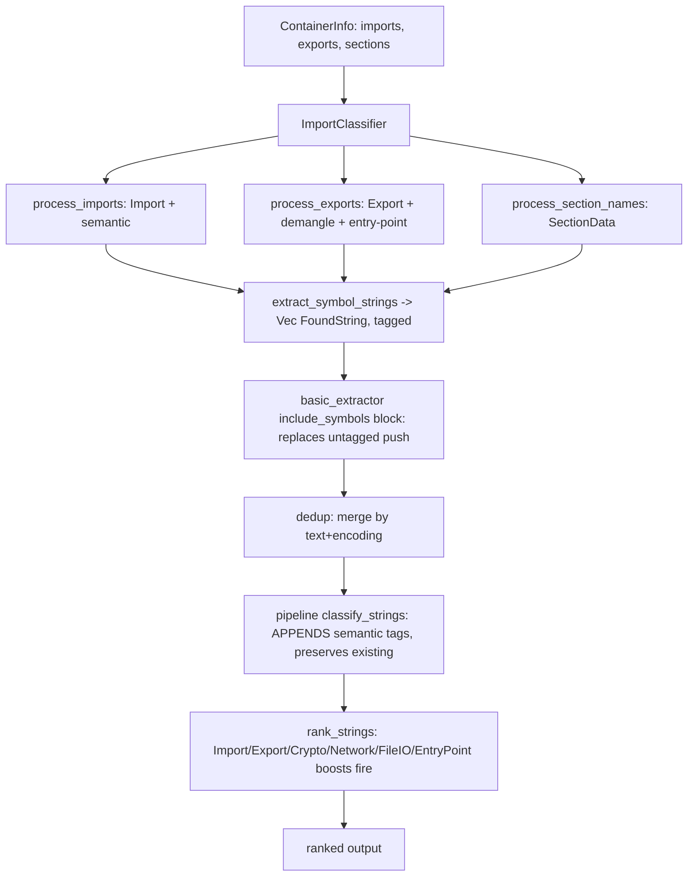

# feat: Import/Export symbol classification pipeline

## Summary

Add an `ImportClassifier` that converts `ContainerInfo` import/export symbols and section names into tagged, scored `FoundString`s, and route it into the extraction path as the single symbol emission point so the already-defined Import/Export ranking boosts finally fire. Four new semantic tags (crypto, network, file-I/O, entry-point) are recognized via static API-name sets and the existing demangler.

---

## Problem Frame

`stringy` already emits import and export names in default output: when `include_symbols` is on (the default), `src/extraction/basic_extractor.rs:67-89` pushes each symbol name as a bare `FoundString` -- no tags, no RVA, no library, no semantic classification. The `RankingEngine` defines +60 boosts for `Tag::Import` and `Tag::Export` (`src/classification/ranking.rs:131-132`), but nothing applies those tags, so the boosts are dead code and symbol strings rank no higher than incidental noise. The demangler, the tag scaffolding, the ranking boosts, and the parsed symbol metadata all exist in isolation; what is missing is the classifier that ties metadata to tags plus the wiring that makes the tagged strings the ones that reach output.

---

## High-Level Technical Design

The classifier becomes the single emission point for symbol strings, replacing the untagged push in the extractor. Tags accumulate down the pipeline rather than being overwritten, so classifier-assigned tags survive to ranking where the boosts apply.

---

## Key Technical Decisions

- KTD1. **Replace the untagged emission at `basic_extractor.rs:67-89`, not add a parallel path.** Dedup merges by `(text, encoding)` with a nondeterministic HashMap winner; a parallel tagged copy alongside the existing untagged one could be the copy dedup discards, silently dropping the tags. A single emission point removes the hazard. (see origin: docs/brainstorms/2026-06-19-symbol-classification-pipeline-requirements.md)
- KTD2. **Rely on the pipeline's append-only classification.** `classify_strings()` pushes each semantic tag only `if !s.tags.contains(&tag)` (`src/pipeline/mod.rs:320-326`), so classifier-assigned `Import`/`Export`/semantic tags are preserved through the pipeline's own pass. No tag-clobber guard is needed; R12 depends on this behavior.
- KTD3. **Export order: tag `Export`, then demangle, then entry-point check.** `SymbolDemangler::demangle(&mut fs)` adds `Tag::DemangledSymbol` and preserves existing tags; the entry-point name match runs against the resulting `text`.
- KTD4. **Wire the four tags as one foundational unit across all co-change sites.** Adding a variant forces updates at two compiler-enforced output formatters plus the enum/`FromStr`, both CLI `long_help` literals, and five variant-enumerating test lists; the build will not compile and CI will not pass until every site is updated, so they land together.
- KTD5. **Static API sets as `LazyLock<HashSet<&'static str>>`.** Mirrors `src/classification/patterns/paths.rs`. Never `once_cell`.
- KTD6. **Section-name emission rides `include_symbols` (default-on).** All three symbol kinds (imports, exports, section names) are bundled behind one `extract_symbol_strings` call at the existing `include_symbols` gate, so the symbols toggle also governs section-name rows.

---

## Requirements

Carried from the origin requirements doc.

**Symbol classification**

- R1. Import names emit as `FoundString`s with `source: StringSource::ImportName`, always carrying `Tag::Import`, at `confidence: 1.0`.
- R2. Imports matching the crypto, network, or file-I/O API sets additionally carry `Tag::Crypto`, `Tag::Network`, or `Tag::FileIO`; non-matching imports carry only `Tag::Import`.
- R3. An import's originating library populates the `section` field when present; when absent, a format-appropriate default is used (`.idata` for PE, `.dynsym` for ELF).
- R4. An import's RVA populates from `ImportInfo::address` when present (optional).
- R5. Export names emit as `FoundString`s with `source: StringSource::ExportName`, always carrying `Tag::Export`, with RVA from `ExportInfo::address`.
- R6. Exports run through `SymbolDemangler`; successfully demangled exports additionally carry `Tag::DemangledSymbol`.
- R7. Exports whose name is a known entry point (`main`, `_start`, `DllMain`, `WinMain`, `wWinMain`) additionally carry `Tag::EntryPoint`.
- R8. Section names emit as standalone `FoundString`s with `source: StringSource::SectionData` at `confidence: 1.0`, ranked alongside other output.

**Type system and ranking**

- R9. Add `Tag` variants `Crypto`, `Network`, `FileIO`, `EntryPoint` with serde renames (`crypto`, `network`, `fileio`, `entry-point`), wired through `Tag::from_str`, the output display formatters, and the CLI help text.
- R10. `RankingConfig` gains tag boosts: `Crypto` +50, `Network` +45, `FileIO` +35, `EntryPoint` +40.

**Pipeline integration**

- R11. The tagged classifier replaces the untagged import/export emission in the extractor so each symbol is emitted once, already tagged; section-name emission is added to the same path.
- R12. Tagged symbol strings flow through the remaining pipeline stages with their classifier-assigned tags preserved, so the Import/Export and new semantic boosts apply to live output.

**Tests and docs**

- R13. `tests/classification_symbols.rs` covers import classification, export classification, API-set detection (at least 3 representative symbols per category plus a negative case), section-name extraction, and end-to-end `extract_symbol_strings` output against the ELF, PE, and Mach-O fixtures.
- R14. `docs/src/classification.md` is updated to reference `std::sync::LazyLock` instead of the stale `once_cell::sync::Lazy` example.

---

## Acceptance Examples

- AE1. **Covers R2.** Import `CreateFileW` yields `Import` + `FileIO`; `connect` yields `Import` + `Network`; `EVP_EncryptInit` yields `Import` + `Crypto`; `printf` yields `Import` only.
- AE2. **Covers R6, R7.** A C++-mangled export demangles and yields `Export` + `DemangledSymbol`; export `main` yields `Export` + `EntryPoint`; export `DllMain` yields `Export` + `EntryPoint`.
- AE3. **Covers R3.** A PE import from `kernel32.dll` sets `section` to `kernel32.dll`; an ELF import with no library sets `section` to `.dynsym`.
- AE4. **Covers R11, R12.** Running `stringy` on a PE fixture (default `include_symbols`) shows `CreateFileW` exactly once, tagged `import` + `fileio` -- not a duplicate untagged row, and not dropped by dedup.

---

## Implementation Units

### U1. New Tag variants and full co-change wiring

- **Goal:** Add `Crypto`, `Network`, `FileIO`, `EntryPoint` to the `Tag` enum and thread them through every site adding a variant touches, so the crate compiles and all tag-enumerating tests pass.
- **Requirements:** R9
- **Dependencies:** none
- **Files:** `src/types/mod.rs`, `src/output/table/formatting.rs`, `src/output/yara/mod.rs`, `src/main.rs`, `src/types/tests.rs`, `src/output/json.rs`, `tests/integration_cli.rs`, `tests/output_yara_integration.rs`
- **Approach:** Add the four variants with serde renames (`crypto`, `network`, `fileio`, `entry-point`). Add `FromStr` arms. Add display arms in `tag_to_display_string` (`src/output/table/formatting.rs:81-103`) and YARA `tag_name` (`src/output/yara/mod.rs:164-187`) -- both are compiler-enforced exhaustive matches. Add the canonical strings to both `--only-tags` and `--no-tags` `long_help` literals (`src/main.rs:108-111`, `122-125`; must be string literals, not `const`/`concat!`). Extend the variant-enumerating test lists.
- **Patterns to follow:** existing `DemangledSymbol` variant (serde rename + `FromStr` arm) in `src/types/mod.rs`; the exhaustive matches in `formatting.rs:81-103` and `yara/mod.rs:164-187`.
- **Test scenarios:**
  - Covers R9. `from_str("crypto"/"network"/"fileio"/"entry-point")` return the matching variants; an unknown string still returns `Err` (extend `test_tag_from_str_all_variants`, `src/types/tests.rs:126-148`).
  - Each new variant produces its display string in `tag_to_display_string` and YARA `tag_name` (extend `all_tag_variants_have_display`, `formatting.rs:224-245`, and `test_yara_all_tag_types`, `tests/output_yara_integration.rs:154-177`).
  - JSON serialization yields the serde-renamed form: `Tag::FileIO` -> `"fileio"`, `Tag::EntryPoint` -> `"entry-point"` (extend `test_all_tag_types_serialize_correct_names`, `src/output/json.rs:159-181`).
  - `stringy --help` lists `crypto`, `network`, `fileio`, `entry-point` under both flags (extend `cli_help_lists_all_canonical_tags`, `tests/integration_cli.rs:264-291`).
- **Verification:** `cargo build` compiles with no non-exhaustive-match errors; the extended variant-list tests pass; `--help` shows the four new tags.

### U2. RankingConfig boosts for the new tags

- **Goal:** Give the four new tags their ranking boosts so semantic symbols outrank noise.
- **Requirements:** R10
- **Dependencies:** U1
- **Files:** `src/classification/ranking.rs`
- **Approach:** Add `tag_boosts.insert(...)` for `Crypto` +50, `Network` +45, `FileIO` +35, `EntryPoint` +40 in `RankingConfig::default()`; add matching assertions in `test_default_config_values`.
- **Patterns to follow:** `ranking.rs:131-132` (Import/Export +60 inserts) and the paired `test_default_config_values` (`ranking.rs:304-349`).
- **Test scenarios:**
  - Covers R10. `tag_boosts.get(&Tag::Crypto) == Some(&50)`, `Network` `&45`, `FileIO` `&35`, `EntryPoint` `&40` (extend `test_default_config_values`).
  - A `FoundString` carrying `Tag::Crypto` scores at least 50 above an otherwise identical untagged string under the default config.
- **Verification:** `test_default_config_values` passes with the four new assertions; a crypto-tagged string ranks above an untagged peer.

### U3. ImportClassifier and extract_symbol_strings

- **Goal:** Build the classifier converting `ContainerInfo` imports/exports/section names into tagged `FoundString`s, plus the `extract_symbol_strings` entry point, and test it directly.
- **Requirements:** R1, R2, R3, R4, R5, R6, R7, R8, R13; AE1, AE2, AE3
- **Dependencies:** U1
- **Files:** `src/classification/imports.rs` (new), `src/classification/mod.rs`, `tests/classification_symbols.rs` (new)
- **Approach:** New `ImportClassifier` holding a `SymbolDemangler` and three `LazyLock<HashSet<&'static str>>` API sets (crypto, network, file-I/O) seeded from the origin lists. `process_imports`: build via `FoundString::new(name, Utf8, 0, len, ImportName)` then builder chain -- tags `[Import]` plus any semantic match, `.with_section(library or .idata/.dynsym default)`, `.with_rva` when `address` is `Some`, `.with_confidence(1.0)`. `process_exports`: tags `[Export]`, RVA from the required `address`, then `demangler.demangle(&mut fs)`, then entry-point check on `fs.text`. `process_section_names`: one `FoundString` per section name, source `SectionData`, confidence 1.0. `extract_symbol_strings(&ContainerInfo)` composes all three. Export `ImportClassifier` and `extract_symbol_strings` from `src/classification/mod.rs` (`pub mod imports;` + `pub use`).
- **Technical design (directional, not a spec):** export processing order -- `new(... ExportName) -> with_tags([Export]) -> with_rva(address) -> demangle(&mut) [adds DemangledSymbol] -> if text in ENTRY_POINTS push EntryPoint`.
- **Patterns to follow:** `LazyLock<HashSet>` idiom in `src/classification/patterns/paths.rs:30-43` (`HashSet::from([...])`); `FoundString::new()` + builder chain only, never struct literals (GOTCHAS); `SymbolDemangler::demangle` in `src/classification/symbols.rs`; fixture loading via `get_fixture_path` in `tests/classification_integration_tests.rs`.
- **Execution note:** Implement classifier behavior test-first.
- **Test scenarios** (`tests/classification_symbols.rs`):
  - Covers R1. Every emitted import carries `Tag::Import`, source `ImportName`, confidence 1.0.
  - Covers AE1. `CreateFileW` -> `Import`+`FileIO`; `connect` -> `Import`+`Network`; `EVP_EncryptInit` -> `Import`+`Crypto`; `printf` -> `Import` only (at least 3 matches per category plus the negative).
  - Covers AE3 / R3. PE import with library `kernel32.dll` -> section `kernel32.dll`; PE import with no library -> `.idata`; ELF import with no library -> `.dynsym`.
  - Covers R4. Import with `address: Some(x)` sets `rva` to `x`; `address: None` leaves `rva` unset.
  - Covers R5. Every export carries `Tag::Export`, source `ExportName`, RVA from `address`.
  - Covers AE2 / R6, R7. A C++-mangled export gains `DemangledSymbol` and demangled text; `main`/`_start`/`DllMain`/`WinMain`/`wWinMain` gain `EntryPoint`; an ordinary export gains neither.
  - Covers R8. Section names emit as `FoundString`s with source `SectionData`, confidence 1.0.
  - Covers R13. `extract_symbol_strings` on parsed ELF/PE/Mach-O fixtures returns tagged import/export/section-name strings; JSON-form comparisons use the serde-renamed tag strings.
- **Verification:** `tests/classification_symbols.rs` passes; `extract_symbol_strings` is reachable as `stringy::classification::extract_symbol_strings`.

### U4. Replace the untagged symbol emission in the extractor

- **Goal:** Route `extract_symbol_strings` into the extraction path as the single symbol emission point so tagged symbols reach live output and the boosts fire.
- **Requirements:** R11, R12; AE4
- **Dependencies:** U3 (also U1, U2 for the tags and their boosts)
- **Files:** `src/extraction/basic_extractor.rs`, affected insta snapshots (e.g. the `tests/snapshots` for `integration_flows_1_5`)
- **Approach:** In `collect_all_strings`, replace the import/export push loops at `basic_extractor.rs:67-89` with a call to `extract_symbol_strings(container_info)`, still inside the `if config.include_symbols` block (which now also governs section-name rows). Dedup then merges by text; `classify_strings` appends semantic tags without clobbering the classifier's (KTD2). Regenerate insta snapshots whose fixture output now shows tagged, reranked symbols. `test_binary.c` is unchanged, so no `just gen-fixtures` -- snapshot regeneration only.
- **Execution note:** Capture current snapshots before the change, then regenerate after, so the snapshot diff is the reviewable record of the output shift.
- **Test scenarios:**
  - Covers AE4 / R11. The pipeline on a PE fixture yields exactly one row per symbol -- no duplicate untagged-plus-tagged pair.
  - Covers R12. A symbol that also matches a semantic pattern carries both its classifier tags and any pipeline-appended tags after `classify_strings`.
  - Covers R11. With `include_symbols = false`, no import/export or section-name rows are emitted; with the default (`true`), they are.
  - Regression: existing flow/snapshot tests pass after regeneration, and symbol strings rank above incidental noise.
- **Verification:** the full `nextest` suite passes after `INSTA_UPDATE=always cargo nextest run`; a CLI run on a PE fixture shows tagged imports ranked up, one row each.

### U5. Documentation fix

- **Goal:** Correct the stale `once_cell` example in the classification docs.
- **Requirements:** R14
- **Dependencies:** none
- **Files:** `docs/src/classification.md`
- **Approach:** Replace the `once_cell::sync::Lazy` usages (`docs/src/classification.md` lines 77, 80, 120) with `std::sync::LazyLock` to match the actual implementation.
- **Patterns to follow:** the `LazyLock` idiom in `src/classification/mod.rs`.
- **Test scenarios:** Test expectation: none -- documentation-only change with no behavioral surface.
- **Verification:** `docs/src/classification.md` no longer references `once_cell` and the example mirrors the `std::sync::LazyLock` pattern.

---

## Scope Boundaries

- New CLI flags to filter the four new tags -- out of scope; the existing `--only-tags`/`--no-tags` machinery covers them once the variants are wired.
- Redesigning deduplication or string-ordering behavior -- out of scope.

### Deferred to Follow-Up Work

- Tuning the exact membership of the crypto/network/file-I/O API sets beyond the origin seed lists -- left to implementation and later iteration.

---

## Risks & Dependencies

- **Snapshot churn.** Routing tagged symbols into default output shifts rank order, so insta snapshots that capture fixture output (notably `integration_flows_1_5`) will change and must be regenerated. This is expected; if a snapshot diff looks wrong (e.g. a symbol losing its tag), investigate before accepting rather than blanket-accepting.
- **Append-only classification (KTD2).** R12 depends on `classify_strings` pushing tags only when absent. If that behavior changes, classifier tags could be lost.
- **Field-shape asymmetry.** `ExportInfo::address` is a required `u64` while `ImportInfo::address` is `Option<u64>` -- export RVA is always set, import RVA is conditional (R4, R5 reflect this).
- **Fixtures gitignored.** `just gen-fixtures` must run before tests; `test_binary.c` is unchanged here, so only snapshot regeneration is needed, not fixture rebuild.

---

## Sources / Research

- `src/extraction/basic_extractor.rs:67-89` -- existing untagged import/export emission that U4 replaces; `src/extraction/traits.rs:97` -- `include_symbols` defaults to `true`.
- `src/pipeline/mod.rs:320-326` -- `classify_strings` appends tags only when absent (basis for KTD2 / R12).
- `src/types/mod.rs` -- `Tag` enum (serde renames; `Import`/`Export`/`DemangledSymbol` present, the four new variants absent), `ImportInfo` (`name`, `library: Option<String>`, `address: Option<u64>`, `ordinal`), `ExportInfo` (`name`, `address: u64`, `ordinal`), `ContainerInfo.imports`/`exports`.
- `src/types/found_string.rs` -- `FoundString::new(text, encoding, offset, length, source)` plus `with_rva`, `with_section`, `with_tags`, `with_confidence` builders (constructor defaults `confidence: 1.0`, empty tags).
- `src/classification/symbols.rs` -- `SymbolDemangler` (Rust via `rustc_demangle`, C++ via `cpp_demangle`); demangle adds `DemangledSymbol` and preserves existing tags.
- `src/classification/ranking.rs:131-132` -- existing Import/Export +60 boosts; `:304-349` -- the paired `test_default_config_values`.
- `src/classification/patterns/paths.rs:30-43` -- `LazyLock<HashSet<&'static str>>` idiom to mirror.
- Exhaustive-match and variant-list co-change sites (U1): `tag_to_display_string` (`src/output/table/formatting.rs:81-103`), YARA `tag_name` (`src/output/yara/mod.rs:164-187`), CLI `long_help` (`src/main.rs:108-111`, `122-125`), and test lists in `src/types/tests.rs:126-148`, `src/output/json.rs:159-181`, `src/output/table/formatting.rs:224-245`, `tests/output_yara_integration.rs:154-177`, `tests/integration_cli.rs:264-291`.
- `docs/src/classification.md:77,80,120` -- stale `once_cell` example that U5 fixes.
- GitHub issue #20 -- originating specification (its "nothing converts imports/exports into FoundStrings" premise is corrected: the extractor already emits them untagged, which U4 replaces).
