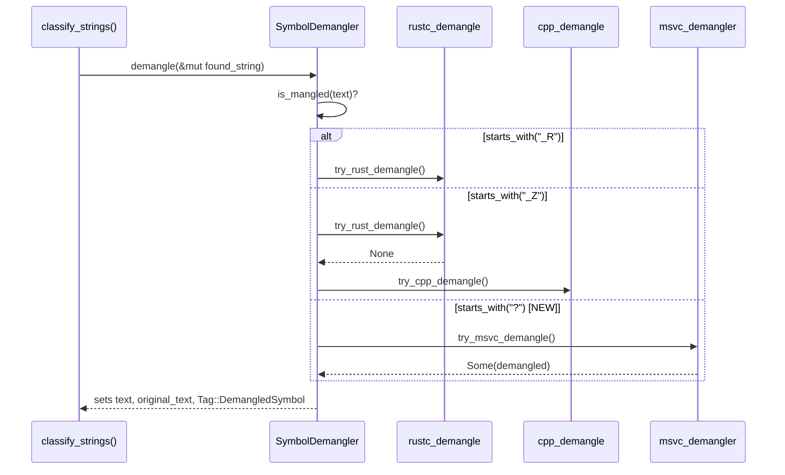

# feat: Add MSVC Symbol Demangling Support for PE Binaries

## Summary

`SymbolDemangler` (`src/classification/symbols.rs`) already demangles Rust legacy (`_ZN`), Rust v0 (`_R`), and C++ Itanium ABI (`_Z`) symbols. The pipeline's `classify_strings()` already flags `?`-prefixed MSVC symbols as mangled candidates, but `SymbolDemangler` has no `?` handling -- so every MSVC-mangled symbol from a Windows PE binary is detected, then silently passed through with no demangled output.

This plan closes that gap by adding the `msvc-demangler` crate, allowing its NCSA license in `deny.toml`, and extending `SymbolDemangler` with a `try_msvc_demangle()` branch that mirrors the existing Rust/C++ helpers exactly. No pipeline changes are required.

---

## Problem Frame

- **Who is affected:** Anyone analyzing Windows PE binaries with Stringy. MSVC is the dominant Windows toolchain, so its `?`-prefixed mangling covers most PE import/export symbols. Today those symbols show as raw mangled noise instead of readable names.
- **Current behavior:** `src/pipeline/mod.rs` `classify_strings()` computes `looks_mangled = ... || s.text.starts_with('?')` and calls `SymbolDemangler::demangle()`. Because `is_mangled()` returns `false` for `?`-prefixed input, `demangle()` early-returns and the symbol is left mangled with no `Tag::DemangledSymbol`.
- **Desired behavior:** `?`-prefixed MSVC symbols are demangled into human-readable form (`?printf@@YAHPEBDZZ` -> `int __cdecl printf(char const * const, ...)`), with the original mangled text preserved in `original_text` and `Tag::DemangledSymbol` applied -- identical to how Rust and C++ symbols are already handled.

---

## Requirements

Traceability to GitHub issue #19 acceptance criteria (Requirement ID 4.1):

- **R1.** `SymbolDemangler::is_mangled()` returns `true` for `?`-prefixed symbols. (U1)
- **R2.** `SymbolDemangler::demangle()` and `try_demangle()` produce demangled MSVC output. (U1)
- **R3.** Demangled MSVC symbols receive `Tag::DemangledSymbol` and preserve the original in `original_text`. (U1 -- reuses existing `demangle()` flow, so this falls out for free.)
- **R4.** Invalid/unknown `?`-prefixed input falls back gracefully (FoundString unchanged). (U1)
- **R5.** No regression in existing Rust/C++ demangling tests. (U1, U3)
- **R6.** `cargo deny check` passes with the new dependency (license + duplicate-version). (U2)
- **R7.** Performance overhead is measured and acceptable. (U3)

---

## Key Technical Decisions

- **Crate choice: `msvc-demangler = "0.11"`.** This is the de-facto Rust MSVC demangler (used by LLVM tooling lineage). Latest stable is `0.11.0` (verified on crates.io 2026-06-19). It mirrors the role `cpp_demangle` plays for Itanium ABI, keeping the three demangle helpers structurally parallel.
- **License handling: add `"NCSA"` to `deny.toml` `[licenses] allow`.** `msvc-demangler` is dual-licensed `MIT/NCSA`. The repo's allow-list has `MIT` but not `NCSA` (University of Illinois/NCSA Open Source License -- an OSI-approved permissive license). Without this, `cargo deny check` fails. Adding NCSA is the minimal change; do **not** broaden other ban/advisory settings.
- **`DemangleFlags::llvm()` for output style.** Matches the issue's proposed solution and produces LLVM-style human-readable output (e.g. `int __cdecl printf(...)`). This is the conventional choice and keeps output consistent with what reverse-engineers expect from `undname`-style tooling.
- **Branch ordering preserved.** `_R` and `_Z` checks stay first; the new `?` branch is added last. MSVC mangling never collides with `_R`/`_Z` prefixes, so ordering is safe, but keeping the new branch last minimizes churn and review surface.
- **Same "differs from input" guard.** `try_msvc_demangle()` returns `Some` only when the demangled string differs from the input -- identical to `try_rust_demangle()` and `try_cpp_demangle()`. This keeps the no-op/failure contract uniform across all three.

---

## High-Level Technical Design

The change extends one decision point in the existing demangle dispatch. Prose carries this adequately, but the dispatch flow is shown for reviewer orientation (directional, not implementation spec):

---

## Implementation Units

### U1. Extend `SymbolDemangler` with MSVC handling

**Goal:** Add `?`-prefix detection and a `try_msvc_demangle()` helper so MSVC symbols flow through the existing `demangle()` / `try_demangle()` machinery.

**Requirements:** R1, R2, R3, R4, R5

**Dependencies:** U2 (the crate must be declared and license-cleared before this compiles)

**Files:**

- `src/classification/symbols.rs` -- modify

**Approach:**

- Add `use msvc_demangler;` (or import the `demangle` fn / `DemangleFlags` as the existing `use cpp_demangle::Symbol as CppSymbol;` style suggests) near the top.
- In `is_mangled()`, after the `_Z` check, add: `if symbol.starts_with('?') { return true; }`.
- In `try_demangle_internal()`, after the `_Z` branch, add: `if symbol.starts_with('?') { return self.try_msvc_demangle(symbol); }`.
- Add private method `fn try_msvc_demangle(&self, symbol: &str) -> Option<String>` that calls `msvc_demangler::demangle(symbol, msvc_demangler::DemangleFlags::llvm()).ok()?` and returns `Some(demangled)` only when it differs from `symbol`, matching the other two helpers.
- Update doc-comments: module-level "Supported Symbol Formats" list (add MSVC `?`), the `is_mangled()` doc + doctest (add an `?printf@@YAHPEBDZZ` assertion), and the `try_demangle()` `# Examples` block (add an MSVC example). Verify doctests still pass (`cargo test --doc`).
- No changes to `demangle()` itself -- R3 (original_text + `Tag::DemangledSymbol`) is satisfied by the existing flow once `try_demangle_internal()` returns `Some`.

**Patterns to follow:** Mirror `try_cpp_demangle()` (`src/classification/symbols.rs:196`) for the helper shape and the "differs from input" guard. Mirror existing doctest style in the `is_mangled` / `try_demangle` doc-comments.

**Test scenarios** (unit tests in the existing `#[cfg(test)] mod tests`, using the `create_test_string` helper):

- `test_is_mangled_msvc_symbols` -- `is_mangled` returns `true` for `?printf@@YAHPEBDZZ`, `??0MyClass@@QEAA@XZ` (constructor), `??HMyClass@@QEAAHH@Z` (operator+). Covers R1.
- `test_is_mangled_msvc_not_triggered_for_plain` -- `is_mangled` still returns `false` for `printf`, `CreateFileW`, `""`. (Edge: empty string, non-mangled Windows API names.)
- `test_demangle_msvc_plain_function` -- `demangle()` on `?printf@@YAHPEBDZZ` sets `original_text` to the mangled form, adds `Tag::DemangledSymbol`, and yields text containing `printf`. Covers R2, R3.
- `test_demangle_msvc_constructor` -- `demangle()` on `??0MyClass@@QEAA@XZ` produces a changed, demangled result containing `MyClass`.
- `test_demangle_msvc_operator` -- `demangle()` on an operator-overload symbol (`??HMyClass@@QEAAHH@Z`) produces a demangled result. (Verify the exact expected substring against real `msvc-demangler` output during implementation rather than asserting a guessed string.)
- `test_demangle_msvc_invalid_fallback` -- `demangle()` on `?notvalid` (a `?`-prefixed string that is not a valid MSVC name) leaves the `FoundString` unchanged: `text` unchanged, `original_text` is `None`, no `Tag::DemangledSymbol`. Covers R4.
- `test_try_demangle_msvc_success` -- `try_demangle("?printf@@YAHPEBDZZ")` returns `Some(_)`.
- `test_try_demangle_msvc_failure` -- `try_demangle("?")` returns `None` (degenerate input).
- `test_msvc_symbol_preserves_existing_tags` -- pre-existing `Tag::Import` survives MSVC demangling and `Tag::DemangledSymbol` is added alongside it. Covers R5 (no tag regression).

**Verification:** `cargo test --lib classification::symbols` passes including the new tests; `cargo test --doc` passes with updated doctests; existing Rust/C++ tests remain green.

**Execution note:** Implement test-first for `try_msvc_demangle` -- write the failing `test_demangle_msvc_plain_function` against `?printf@@YAHPEBDZZ`, confirm it fails (symbol passes through unchanged), then add the branch + helper. The exact demangled strings for constructor/operator cases should be pinned to real crate output, so write those assertions after a quick REPL/println check rather than guessing.

---

### U2. Add the dependency and clear the license gate

**Goal:** Declare `msvc-demangler` and make `cargo deny check` pass.

**Requirements:** R6

**Dependencies:** none (this unit unblocks U1)

**Files:**

- `Cargo.toml` -- modify (add dependency)
- `Cargo.lock` -- regenerated by cargo (commit the update)
- `deny.toml` -- modify (allow NCSA license)

**Approach:**

- Add `msvc-demangler = "0.11"` to `[dependencies]`, placed alphabetically between `mmap-guard` (line 28) and `patharg` (line 29) to match the existing sorted, aligned style. Preserve the column alignment of the `=` signs used in that block.
- Add `"NCSA"` to the `[licenses] allow` array in `deny.toml`. Place it among the existing permissive licenses (e.g. after `"MIT"` or in alphabetical position) and keep the formatting consistent with surrounding entries.
- Run `cargo build` to regenerate `Cargo.lock`, then `cargo deny check` to confirm both the license gate and the `multiple-versions = "deny"` / `wildcards = 'deny'` bans still pass.

**Patterns to follow:** Existing alphabetical, aligned dependency block in `Cargo.toml` (lines 23-36). Existing `allow` list formatting in `deny.toml` `[licenses]`.

**Test scenarios:** `Test expectation: none -- dependency/config change with no behavioral logic.` Validation is `cargo deny check` (see Verification), not unit tests.

**Verification:** `cargo build` succeeds; `cargo deny check` exits 0 (licenses + bans + advisories all pass); `cargo tree -d` shows no new duplicate versions introduced by `msvc-demangler`'s transitive deps (see Risks -- `multiple-versions = "deny"`).

---

### U3. Regression and performance verification

**Goal:** Confirm no regressions across the suite and that the added demangling path carries acceptable overhead.

**Requirements:** R5, R7

**Dependencies:** U1, U2

**Files:**

- No production source changes. (Benchmark wiring only if a symbol-demangling bench does not already exist -- see Approach.)

**Approach:**

- Run the full suite via `just test` (nextest) plus `cargo test --doc` to confirm R5 across unit, doc, and integration tests.
- Run `just lint` (`cargo clippy -- -D warnings`) and `cargo fmt --check` -- the new code must be warning-clean per the project's zero-warning rule.
- For R7: check `benches/` for an existing classification/demangling benchmark. If one exists, run `just bench` and record that MSVC demangling overhead is comparable to the existing Rust/C++ paths (same per-symbol crate-call shape, so overhead is expected to be in line). If no relevant bench exists, do **not** build new bench infrastructure here -- instead record a brief measured note (e.g. timing a batch of representative `?`-symbols via a throwaway test or existing pipeline timing) and capture the result in the PR description. The acceptance bar is "measured and acceptable," not a new permanent benchmark harness.

**Patterns to follow:** Existing `benches/` setup and `just bench` recipe if present; existing CI test invocation via `just test`.

**Test scenarios:** `Test expectation: none -- verification unit; exercises existing tests and tooling rather than adding new behavior.`

**Verification:** `just test` green; `cargo test --doc` green; `just lint` clean; `cargo fmt --check` clean; performance note captured for the PR.

---

## Scope Boundaries

**In scope:**

- MSVC (`?`-prefix) demangling in `SymbolDemangler`.
- The `msvc-demangler` dependency and its NCSA license allowance.
- Unit/doc tests for the new path and regression confirmation.

**Out of scope (non-goals):**

- Pipeline changes -- `classify_strings()` already detects `?` and needs no edits.
- New PE fixture binaries containing MSVC symbols. The issue mentions integration tests "if available under `tests/fixtures/`"; generating new MSVC-mangled PE fixtures is a fixture-toolchain effort out of proportion to this change. Unit tests against known mangled strings provide the coverage.
- Configurable enable/disable of demangling -- not requested, and inconsistent with the always-on Rust/C++ behavior. YAGNI.

### Deferred to Follow-Up Work

- Real-PE-fixture integration coverage for MSVC symbols, pending a fixture-generation path for MSVC-mangled PE binaries (current fixtures are Zig-cross-compiled and use Itanium ABI).
- A permanent demangling benchmark in `benches/` if one does not already exist and the team wants ongoing perf tracking.

---

## Risks & Dependencies

- **Duplicate transitive versions (`multiple-versions = "deny"`).** `msvc-demangler` pulls in `bitflags` (and possibly others). If it introduces a second major version of a crate already in the tree, `cargo deny check` will fail. **Mitigation:** run `cargo tree -d` in U2; if a duplicate appears, resolve via a compatible version bump or a justified `skip`/`skip-tree` entry in `deny.toml` with an inline comment. Do not blanket-disable the ban.
- **Exact demangled output strings.** MSVC demangled output (spacing, `__cdecl`, pointer formatting) depends on `DemangleFlags` and crate version. **Mitigation:** assert on stable substrings (`printf`, `MyClass`) rather than full exact strings for the operator/constructor cases, and pin any full-string assertions to verified real output.
- **MSRV compatibility (1.91).** Confirm `msvc-demangler 0.11` and its deps build under the project MSRV. **Mitigation:** the MSRV CI matrix will catch this; check locally with the pinned toolchain if concerned before pushing.
- **`forbid(unsafe_code)`.** `msvc-demangler` is a normal dependency (the forbid applies to Stringy's own crates, not deps), so this is not a blocker -- noted only to preempt confusion.

---

## Sources & Research

- GitHub issue #19 -- "Add MSVC Symbol Demangling Support for PE Binaries" (origin; includes CodeRabbit codebase analysis and a Traycer implementation plan that this plan refines).
- crates.io `msvc-demangler` -- latest stable `0.11.0`, license `MIT/NCSA` (verified 2026-06-19).
- `src/classification/symbols.rs` -- existing `SymbolDemangler` (Rust/C++ helpers to mirror).
- `src/pipeline/mod.rs` `classify_strings()` -- existing `?`-prefix detection (no change needed).
- `Cargo.toml` (lines 23-36), `deny.toml` `[licenses]`/`[bans]` -- dependency and policy surfaces.
