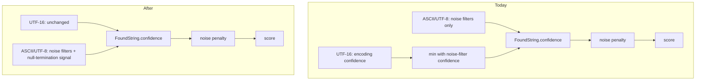

# Encoding Confidence Close-Out (Issue 22) - Plan

## Goal Capsule

- **Objective:** Close out GitHub issue 22 by delivering its one real remaining gap -- a null-termination confidence signal for narrow (ASCII/UTF-8) strings -- plus a ranking-docs correction, then closing the issue with a criterion-by-criterion disposition.
- **Product authority:** Issue 22 treated as intent, not literal spec (owner decision, 2026-07-01). Where the issue conflicts with the shipped ranking architecture, the architecture wins. This plan's Product Contract is the requirements authority; AGENTS.md and GOTCHAS.md govern conventions.
- **Execution profile:** Test-first for the new signal (repo policy: tests required for new functionality). Snapshot churn is expected and accepted; review regenerated snapshots before accepting.
- **Stop conditions:** Stop and surface if the signal causes widespread ranking reorderings that cannot be explained by termination differences, or if dedup merges make AE1 unverifiable even at the extractor level.
- **Open blockers:** None.
- **Product Contract preservation:** Product Contract unchanged by planning; the two Outstanding Questions deferred to planning are resolved as KTD1 and KTD2 in the Planning Contract.

---

## Product Contract

### Summary

Add a null-termination confidence signal to narrow-string extraction so encoding quality influences ranking for ASCII/UTF-8 strings the way it already does for UTF-16, update `docs/src/ranking.md` to describe how encoding quality actually reaches the score, and close issue 22 with a mapping of each original acceptance criterion to its actual disposition.

### Problem Frame

Issue 22 asks for two things: encoding confidence scoring (requirement 5.1) and section weight integration (requirement 5.5). Its "Not Yet Implemented" list predates the current codebase and is wrong on every count: `FoundString.score` is populated end-to-end, section weight is already multiplied into the score, and semantic boost and noise penalty are implemented and tested (`src/classification/ranking.rs`). Encoding confidence also partially exists -- UTF-16 extraction computes an encoding-specific confidence and combines it with noise-filter confidence, which drives the noise penalty.

Two gaps are real. Narrow (ASCII/UTF-8) strings get only generic noise-filter confidence -- no encoding-specific signal such as null termination (`src/extraction/ascii/extraction.rs`, verified: zero termination-related logic). And the shipped ranking documentation omits any mention of how encoding quality reaches the score, while the issue cites a formula from a `concept.md` that no longer exists in the repo.

### Key Decisions

- **No new additive `EncodingConfidence` ranking term.** The issue's proposed formula (`Score = SectionWeight + EncodingConfidence + SemanticBoost - NoisePenalty`) would double-penalize printability and control-character density, which the noise penalty already covers via `FoundString.confidence`. The shipped formula (`Final Score = SectionWeight + SemanticBoost - NoisePenalty`, `docs/src/ranking.md`) stays authoritative.
- **Deliver 5.1 through the existing confidence path.** The narrow-string signal feeds `FoundString.confidence`, mirroring how UTF-16 already combines `calculate_utf16_confidence` with noise-filter confidence. No new module; the ranking engine is untouched.
- **Declare 5.5 already done.** Section weight integration shipped with the ranking system (`src/classification/ranking.rs:250-253`); the close-out records this rather than re-implementing it.

How encoding quality reaches the score, before and after:

### Requirements

**Encoding-quality signal (5.1)**

- R1. A narrow (ASCII/UTF-8) string terminated by a null byte is treated as more trustworthy than an otherwise-identical string cut off by a non-null byte, and this signal reaches the ranking score through the existing confidence-to-noise-penalty path.
- R2. The signal stays within the existing `FoundString.confidence` contract (0.0-1.0) and never overrides a lower noise-filter verdict upward.
- R3. UTF-16 extraction behavior is unchanged; its existing encoding-specific confidence (unicode validity, printability, interior-null patterns) covers 5.1 for wide strings, except termination-byte quality, which is an accepted limitation recorded in Scope Boundaries.

**Documentation**

- R4. `docs/src/ranking.md` explains how encoding quality influences ranking -- the UTF-16 confidence combination and the narrow-string null-termination signal -- so the shipped docs, not the phantom `concept.md` formula, are the single source of truth.

**Issue close-out**

- R5. Issue 22 is closed with a comment mapping each original acceptance criterion to its disposition: already implemented (score population, section weight, semantic boost, and noise penalty -- the last two contrary to a stale bot comment on the issue that calls them planned), delivered differently (encoding confidence via the confidence path), or rejected with reason (additive term, new scoring module).

**Testing**

- R6. The new signal has unit tests covering null-terminated, non-null-terminated, and buffer-end termination cases, per the repo's tests-for-new-functionality policy.
- R7. Fixture snapshots affected by confidence shifts are regenerated and reviewed for sanity (clean strings should not drop; ordering changes should be explainable by the new signal).

### Acceptance Examples

- AE1. **Covers R1.** Given two identical printable runs in the same section, one ending at a null byte and one cut off by a non-printable non-null byte, when the pipeline ranks them, then the null-terminated string's score is greater than or equal to the other's.
- AE2. **Covers R2.** Given a string the noise filters already rate low (e.g., high-entropy junk) that happens to be null-terminated, when confidence is computed, then the final confidence is not higher than the noise-filter value alone.

### Scope Boundaries

- No additive `EncodingConfidence` score component and no `src/scoring/` module -- rejected, not deferred.
- No retuning of the 0-100 display-score normalization bands (`src/pipeline/normalizer.rs`).
- No changes to UTF-16 confidence, semantic boost, or noise penalty logic.
- UTF-16 termination-byte quality stays unevaluated: `has_null_terminator` in wide-string extraction informs byte trimming only and never feeds confidence. Accepted limitation -- the R5 close-out comment must not claim termination coverage for wide strings.
- No user-configurable ranking (out of scope in the original ranking ticket; unchanged here).

### Dependencies / Assumptions

- The work is completeness-driven: no observed bad ranking motivates it, so the bar is sensible behavior plus non-degradation, not fixing a known case.
- Snapshot churn from confidence shifts is acceptable (owner confirmed).
- Branch `22-implement-encoding-confidence-scoring-and-integrate-section-weights-into-ranking-system` is identical to `main` as of 2026-07-01.

### Sources / Research

- `src/classification/ranking.rs:243-269` -- score formula and `FoundString.score` population.
- `src/pipeline/mod.rs:341-357` -- pipeline invocation of the ranking engine.
- `src/extraction/utf16/extraction.rs:230,346-349` -- UTF-16 encoding confidence combined with noise-filter confidence via `min`; `has_null_terminator` (lines 165-216) informs byte trimming only and does not feed confidence.
- `src/extraction/ascii/extraction.rs:68-145,256-267` -- narrow-string extraction; terminating byte is in scope at `FoundString` construction (feasibility), confidence currently from noise filters only.
- `docs/src/ranking.md:8` -- shipped formula with no encoding-confidence term.
- `project_plan/tickets/Implement_ranking_system_with_configurable_scoring.md` -- original ranking-system ticket matching shipped code.
- GitHub issue 22 -- original requirements 5.1/5.5; "Current State" section verified stale on 2026-07-01.
- `docs/adr/0003-encoding-confidence-via-confidence-path.md` -- the architectural decision this plan executes.

---

## Planning Contract

### Key Technical Decisions

- **KTD1: Termination signal is a min-combined confidence cap, magnitude 0.9.** Narrow-string extraction computes a termination confidence -- 1.0 for null-terminated strings, a named constant (0.9) for strings cut off by a non-null byte -- and combines it as `confidence = confidence.min(termination_confidence)`, mirroring UTF-16's pattern at `src/extraction/utf16/extraction.rs:346-349`. The min shape satisfies R2 structurally (it can never raise confidence above the noise-filter verdict), and the 0.9 magnitude caps the ranking effect at 10 noise-penalty points -- a tie-breaker against section weights on the order of 100-1000, addressing the review's adversarial-strings concern (unterminated malware strings are nudged, never buried).
- **KTD2: Buffer-end termination is neutral.** A string running to the end of its data slice gets termination confidence 1.0 -- termination is unknown there, and unknown is not evidence of noise. Resolves the Product Contract's second deferred question.
- **KTD3: Termination kind is re-derived at confidence-assignment time from raw section bytes.** `extract_ascii_strings` returns a bare `Vec<FoundString>` and `FoundString` carries no terminator field; changing the signature would break ~30 call sites and adding a field is a GOTCHAS-documented multi-file ripple. Instead, in `extract_from_section`'s post-processing loop (`src/extraction/ascii/extraction.rs:256-267`), read `section_data.get(relative_offset + length)` while the string's offset is still section-relative (before the absolute-offset adjustment): `Some(&0)` = null-terminated, `None` = buffer-end (KTD2), any other byte = non-null cutoff. The ordering dependency on the pre-adjustment offset is a constraint worth a code comment.
- **KTD4: The termination cap applies regardless of noise-filter enablement.** The post-processing pass has two mutually exclusive branches -- noise-filter confidence when filtering is enabled, a hardcoded 1.0 default when disabled. Apply KTD1's min after confidence is set in **both** branches, not only alongside the noise-filter call. This keeps parity with UTF-16, which stores encoding-specific confidence even when filtering is disabled.

### Assumptions

- AE1 is enforced at the extractor level (pre-dedup). Deduplication may collapse identical texts into one row, so pipeline-level integration tests must use distinct-but-comparable strings; if dedup's confidence-merge behavior surprises, surface it rather than weakening the assertion.
- No normalizer band retune is needed: the maximum score shift from KTD1 is 10 points, well inside existing band widths (`src/pipeline/normalizer.rs`).
- External research was skipped deliberately -- the UTF-16 confidence path is a strong local precedent for exactly this pattern.

---

## Implementation Units

### U1. Termination-aware confidence for narrow strings

- **Goal:** A narrow (ASCII/UTF-8) string cut off by a non-null byte gets its confidence capped at 0.9; null-terminated and buffer-end strings are unaffected.
- **Requirements:** R1, R2, R3 (by leaving UTF-16 untouched), R6.
- **Dependencies:** None.
- **Files:** `src/extraction/ascii/extraction.rs`, `src/extraction/ascii/tests.rs` (unit tests), possibly `src/extraction/ascii/mod.rs` (re-exports).
- **Approach:** KTD1 + KTD2 + KTD3 + KTD4. Name the 0.9 constant (no magic numbers). Keep the change inside the ascii module; do not touch `RankingEngine`, the noise filters, or UTF-16 code paths.
- **Execution note:** Write the failing unit tests first; the repo mandates tests for new functionality.
- **Patterns to follow:** UTF-16's confidence combination (`src/extraction/utf16/extraction.rs:230,346-349`) and its confidence module layout (`src/extraction/utf16/confidence.rs`). `FoundString` mutation via existing builder/setter patterns, never struct literals (GOTCHAS.md).
- **Test scenarios:**
  - Null-terminated clean string keeps its noise-filter confidence (no cap applied).
  - Identical string cut off by a non-printable non-null byte has confidence capped at 0.9 and ranks at or below the null-terminated twin at the extractor level (Covers AE1).
  - String running to the buffer end keeps its noise-filter confidence (KTD2 neutral).
  - High-entropy junk that noise filters rate below 0.9 is not raised by being null-terminated (Covers AE2).
  - With noise filtering disabled, a non-null-terminated string still gets the 0.9 cap (KTD4).
- **Verification:** New unit tests pass; existing extraction tests still pass; `cargo clippy -- -D warnings` clean.

### U2. Pipeline verification and snapshot regeneration

- **Goal:** End-to-end scoring reflects the new signal, and all snapshot churn is reviewed and accepted deliberately.
- **Requirements:** R7; integration-level backing for AE1 (AE2 is fully covered at the extractor level by U1's high-entropy-junk scenario).
- **Dependencies:** U1.
- **Files:** existing insta snapshot files under `tests/` (regenerated), `tests/test_ascii_integration.rs` for any added pipeline assertion.
- **Approach:** Regenerate fixtures and snapshots (`just gen-fixtures`, then `INSTA_UPDATE=always cargo nextest run` or `cargo insta accept`). Review the snapshot diff: clean meaningful strings must not drop bands; every reordering must be explainable by termination differences. Use distinct-but-comparable strings for any new pipeline-level assertion (see Assumptions on dedup).
- **Test scenarios:**
  - Snapshot diff review: no clean `.rodata`/`__cstring` string loses display-score band solely from the new cap.
  - Pipeline run over an existing fixture: a non-null-terminated printable run scores at or below an equivalent terminated string (Covers AE1 at integration level, distinct texts).
- **Verification:** `just test` green with regenerated snapshots; diff reviewed and explainable.

### U3. Ranking documentation update

- **Goal:** `docs/src/ranking.md` explains how encoding quality reaches the score, replacing the phantom `concept.md` formula as the reference (R4).
- **Requirements:** R4.
- **Dependencies:** U1 (documents the shipped behavior, including the 0.9 cap).
- **Files:** `docs/src/ranking.md`.
- **Approach:** Add an encoding-quality subsection: UTF-16 encoding confidence min-combined with noise-filter confidence; narrow-string null-termination cap; both feed the noise penalty -- the formula itself is unchanged. ASCII-only prose per repo rules.
- **Test scenarios:** Test expectation: none -- documentation-only unit; markdownlint and lychee link checks run in CI.
- **Verification:** Docs build cleanly (`mdbook` via CI or `just` docs recipe if present); prose matches implemented behavior.

### U4. Issue 22 close-out

- **Goal:** Issue 22 is closed with a criterion-by-criterion disposition (R5).
- **Requirements:** R5.
- **Dependencies:** U1, U2, U3 (disposition must reflect shipped reality).
- **Files:** none (GitHub-side action; disposition text composed from this plan).
- **Approach:** The PR body carries the disposition mapping and `Closes #22` so merge closes the issue. Additionally post the disposition as a comment on issue 22 via `gh issue comment` at ship time. Disposition mapping: score population / section weight / semantic boost / noise penalty = already implemented (`src/classification/ranking.rs`); encoding confidence = delivered via the confidence path (this plan, ADR-0003); additive term and `src/scoring/` module = rejected (ADR-0003); UTF-16 termination-byte quality = accepted limitation (Scope Boundaries).
- **Test scenarios:** Test expectation: none -- repository-external action.
- **Verification:** Issue comment posted; PR body contains the mapping and `Closes #22`.

---

## Verification Contract

| Gate                               | Command                                     | Applies to                       |
| ---------------------------------- | ------------------------------------------- | -------------------------------- |
| Fixtures present                   | `just gen-fixtures`                         | before any test run              |
| Full test suite                    | `just test`                                 | U1, U2                           |
| Snapshot acceptance                | `cargo insta accept` (after reviewing diff) | U2                               |
| Lint + format + tests (final gate) | `just ci-check` (must exit 0)               | all units, before declaring done |

Snapshot regeneration is expected (R7); accepting unreviewed snapshot diffs is not -- the diff review in U2 is part of the gate.

---

## Definition of Done

- R1-R7 satisfied; U1-U4 complete in dependency order.
- `just ci-check` exits 0 (mandatory final gate).
- Regenerated snapshots reviewed: no unexplained reorderings, no clean-string band drops.
- `docs/src/ranking.md` matches implemented behavior.
- PR body carries the issue-22 disposition mapping and `Closes #22`; disposition comment posted to the issue.
- No abandoned or experimental code left in the diff.
