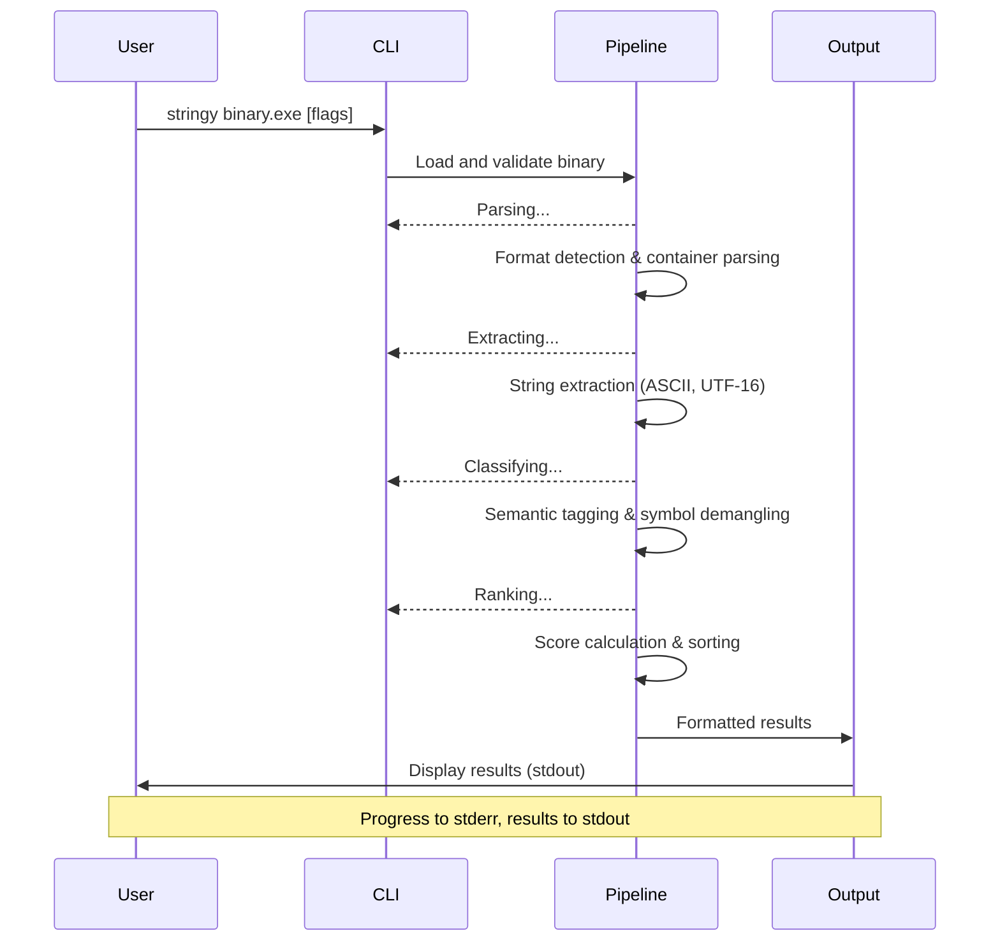

# Core Flows: Stringy v1.0 User Interactions

## Overview

This document defines the core user flows for Stringy v1.0, capturing how users interact with the tool across different use cases: quick analysis, filtered searches, automated integration, and YARA rule generation.

## Design Principles

**Information Hierarchy:**

- String content is primary (users scan for recognizable patterns)
- Tags and scores provide context for prioritization
- Section information aids in understanding string provenance
- Full metadata available in JSON for programmatic access

**User Journey:**

- Entry: Command-line invocation with binary file path
- Processing: Stage-based progress feedback to stderr
- Output: Format adapts to context (TTY vs pipe, human vs machine)
- Exit: Clean exit codes for scripting integration

**Feedback & State:**

- Progress shown via stage indicators (Parsing... Extracting... Classifying... Ranking...)
- Errors go to stderr with brief, actionable messages
- Success indicated by results on stdout
- Summary statistics available via --summary flag



## Flow 1: Quick Analysis (Default)

**Description:** User runs Stringy on a binary to see all meaningful strings ranked by relevance. Unlike GNU strings which extracts every printable sequence, Stringy uses format-aware filtering to exclude noise (padding, binary tables, code sections) while behaving like strings for legitimate text data.

**Trigger:** `stringy binary.exe`

**Default Behavior:**

- No minimum length filter applied by default (behaves like GNU strings)
- Format-aware filtering removes strings from sections known to contain non-text data
- All extracted strings are shown, ranked by score
- The value proposition is intelligent filtering, not output limiting

**Steps:**

01. User invokes Stringy with binary file path
02. System displays "Parsing..." to stderr
03. System detects format (ELF/PE/Mach-O) and parses container structure
04. System displays "Extracting..." to stderr
05. System extracts strings from appropriate sections using format knowledge
06. System displays "Classifying..." to stderr
07. System applies semantic classification (URLs, IPs, paths, GUIDs, etc.)
08. System demangles Rust/C++ symbols to readable form
09. System displays "Ranking..." to stderr
10. System calculates scores based on section weights, semantic boosts, and noise penalties
11. System sorts strings by score (descending)
12. System outputs table to stdout with columns: String | Tags | Score | Section
13. Each string shown in full (terminal handles wrapping)
14. Tags column shows primary tag only
15. Demangled symbols shown in readable form (original mangled form discarded)

**Output Format (TTY):**

```text
String                                    Tags        Score  Section
https://malicious-c2.example.com/api     url         95     .rdata
C:\Windows\System32\kernel32.dll         filepath    88     .rdata
core::fmt::Display::fmt                  export      85     .text
192.168.1.100                            ipv4        82     .rodata
{A1B2C3D4-E5F6-7890-ABCD-EF1234567890}  guid        80     .data
```

**Exit:** Returns exit code 0 on success

---

## Flow 2: Filtered Analysis

**Description:** User applies filters to focus on specific string types, encodings, or characteristics.

**Trigger:** `stringy binary.exe --only-tags url,ipv4 --min-len 10 --enc utf16`

**Note:** The --enc flag accepts both specific encodings (utf16le, utf16be) and grouped values (utf16 matches both LE and BE variants).

**Steps:**

1. User invokes Stringy with filtering flags

2. System performs standard analysis pipeline (Parsing... Extracting... Classifying... Ranking...)

3. System applies filters with AND logic:

   - String must have tag "url" OR "ipv4"
   - String length must be >= 10 characters
   - String encoding must be UTF-16

4. System outputs filtered results in table format

5. If no strings match filters, system displays to stderr: "Analyzed 1,234 strings, 0 matched filters"

6. If strings match, system outputs table with matching strings only

**Filter Combination Rules:**

- All filter types are AND-ed together
- Within --only-tags, tags are OR-ed (match any specified tag)
- --notags excludes strings with any of the specified tags
- --top applies after all other filters

**Exit:** Returns exit code 0 (even if no matches)

**Conflicting Flags:**\
If multiple output format flags are specified (e.g., --json and --yara), the system displays an error:

- Output to stderr: "Error: Cannot specify multiple output formats (--json, --yara)"
- Exit code: 1

---

## Flow 3: Top N Results

**Description:** User limits output to the highest-ranked strings for quick triage.

**Trigger:** `stringy binary.exe --top 50`

**Steps:**

1. User invokes Stringy with --top flag
2. System performs standard analysis pipeline
3. System ranks all strings by score
4. System selects top 50 highest-scoring strings
5. System outputs table with only top 50 results

**With Filters:** `stringy binary.exe --only-tags url --top 20`

- Filters applied first (select all URLs)
- Then top 20 URLs by score selected
- Result: "Top 20 URLs" not "Top 20 overall that happen to be URLs"

**Exit:** Returns exit code 0

---

## Flow 4: Automated Integration (JSON)

**Description:** User generates machine-readable output for integration into analysis pipelines or scripts.

**Trigger:** `stringy binary.exe --json`

**Steps:**

1. User invokes Stringy with --json flag
2. System performs standard analysis pipeline
3. Progress indicators go to stderr (not stdout)
4. System outputs JSONL (JSON Lines) to stdout
5. Each line is a complete JSON object representing one string
6. JSON includes all metadata: text, encoding, offset, rva, section, length, tags (full list), score, source, confidence

**JSON Format:**

```text
{"text":"https://example.com","encoding":"Ascii","offset":4096,"rva":8192,"section":".rdata","length":19,"tags":["url","domain"],"score":95,"source":"SectionData","confidence":1.0}
{"text":"C:\\Windows\\System32","encoding":"Utf16Le","offset":8192,"rva":12288,"section":".data","length":38,"tags":["filepath"],"score":88,"source":"SectionData","confidence":0.95}
```

**Use Cases:**

- Piping to jq for filtering: `stringy binary.exe --json | jq 'select(.tags[] == "url")'`
- Importing into analysis tools
- Batch processing with scripts

**Exit:** Returns exit code 0

---

## Flow 5: YARA Rule Generation

**Description:** User generates YARA-friendly output for creating detection rules.

**Trigger:** `stringy binary.exe --yara`

**Steps:**

1. User invokes Stringy with --yara flag

2. System performs standard analysis pipeline

3. Progress indicators go to stderr

4. System generates complete YARA rule template to stdout

5. Rule includes:

   - Rule name (derived from binary filename)
   - Metadata section (file hash, analysis date, tool version)
   - Strings section with properly escaped strings
   - Condition section (basic template)

6. Strings are escaped according to YARA syntax rules

7. Very long strings (>200 chars) are truncated with comment

**YARA Output Format:**

```text
rule binary_strings {
    meta:
        description = "Strings extracted from binary.exe"
        tool = "Stringy v1.0"
        date = "2024-01-15"
        
    strings:
        $s1 = "https://malicious-c2.example.com/api" ascii wide
        $s2 = "C:\\Windows\\System32\\kernel32.dll" ascii wide
        $s3 = "core::fmt::Display::fmt" ascii
        $s4 = "192.168.1.100" ascii
        // Skipped: too long (245 chars)
        
    condition:
        any of them
}
```

**YARA Rule Naming:**

- Rule name derived from binary filename
- Non-alphanumeric characters replaced with underscore
- File extension removed
- Suffix `_strings` added
- Example: "binary.exe" becomes "binary_strings", "my-app.dll" becomes "my_app_strings"

**YARA String Handling:**

- Strings over 200 characters are skipped with comment: "// Skipped: too long (N chars)"
- Strings properly escaped according to YARA syntax
- Both ascii and wide modifiers included for compatibility

**Exit:** Returns exit code 0

---

## Flow 6: Non-TTY Piping

**Description:** User pipes Stringy output to other Unix tools for further processing.

**Trigger:** `stringy binary.exe | grep "http"`

**Steps:**

1. User invokes Stringy with output piped to another command
2. System detects non-TTY output (stdout is not a terminal)
3. System performs standard analysis pipeline
4. Progress indicators go to stderr (visible to user)
5. System outputs plain strings to stdout (no table formatting)
6. Each string on its own line
7. No headers, no columns, no decorations
8. Pipe-friendly format for grep, awk, sed, etc.

**Output Format (Non-TTY):**

```text
https://malicious-c2.example.com/api
C:\Windows\System32\kernel32.dll
core::fmt::Display::fmt
192.168.1.100
{A1B2C3D4-E5F6-7890-ABCD-EF1234567890}
```

**Exit:** Returns exit code 0

---

## Flow 7: Summary Statistics

**Description:** User requests summary information about the analysis.

**Trigger:** `stringy binary.exe --summary`

**Steps:**

1. User invokes Stringy with --summary flag
2. System performs standard analysis pipeline
3. System outputs results in standard format (table or JSON)
4. After results, system outputs summary to stdout:
   - Binary format detected
   - Total strings extracted
   - Strings after filtering (if filters applied)
   - Top tags found
   - Analysis time

**Summary Format:**

```text
[Results table here]

Summary:
  Binary: binary.exe (PE, 2.4 MB)
  Format: PE (Windows executable)
  Strings extracted: 1,234
  Strings shown: 1,234
  Top tags: url (45), filepath (123), import (234), export (89)
  Analysis time: 0.8s
```

**Note:** The --summary flag is ignored when --json is specified, as JSON output is intended for automation and doesn't need human-readable summaries.

**Exit:** Returns exit code 0

---

## Flow 8: Error Handling

**Description:** System handles errors and edge cases gracefully.

**Common Error Scenarios:**

**Unsupported Format:**

- Trigger: `stringy unknown_format.bin`
- Output to stderr: "Error: Unsupported file format"
- Exit code: 1

**File Not Found:**

- Trigger: `stringy nonexistent.exe`
- Output to stderr: "Error: File not found: nonexistent.exe"
- Exit code: 1

**Invalid Filter:**

- Trigger: `stringy binary.exe --only-tags invalid_tag`
- Output to stderr: "Error: Unknown tag 'invalid_tag'. Use --help to see available tags."
- Exit code: 1

**Corrupted Binary:**

- Trigger: `stringy corrupted.exe`
- Output to stderr: "Error: Binary parsing failed: invalid PE header"
- Exit code: 1

**No Strings Found:**

- Trigger: `stringy empty.bin`
- Output to stderr: "Analyzed empty.bin: found 0 strings"
- Exit code: 0 (not an error, just no results)

---

## CLI Flag Reference

| Flag               | Description                                                                       | Example                |
| ------------------ | --------------------------------------------------------------------------------- | ---------------------- |
| `--min-len N`      | Minimum string length                                                             | `--min-len 10`         |
| `--enc ENCODING`   | Filter by encoding. Accepts: ascii, utf8, utf16 (both LE/BE), utf16le, utf16be    | `--enc utf16`          |
| `--only-tags TAGS` | Include only specified tags (comma-separated)                                     | `--only-tags url,ipv4` |
| `--notags TAGS`    | Exclude specified tags                                                            | `--notags debug,test`  |
| `--top N`          | Show only top N results                                                           | `--top 50`             |
| `--json`           | Output JSONL format                                                               | `--json`               |
| `--yara`           | Output YARA rule template                                                         | `--yara`               |
| `--summary`        | Show summary statistics                                                           | `--summary`            |
| `--debug`          | Include score breakdown in output (section_weight, semantic_boost, noise_penalty) | `--debug`              |
| `--help`           | Show help including available tags                                                | `--help`               |
| `--version`        | Show version information                                                          | `--version`            |

**Available Tags (shown in --help):**

- `url` - HTTP/HTTPS URLs
- `domain` - Domain names
- `ipv4` - IPv4 addresses
- `ipv6` - IPv6 addresses
- `filepath` - File paths (Windows/POSIX)
- `regpath` - Windows registry paths
- `guid` - GUIDs/UUIDs
- `email` - Email addresses
- `b64` - Base64-encoded data
- `fmt` - Printf-style format strings
- `user-agent-ish` - User agent strings
- `import` - Import symbols
- `export` - Export symbols
- `version` - Version strings
- `manifest` - Manifest data
- `resource` - Resource strings

---

## Output Format Details

**Table Column Widths:**

- String: Flexible (shows full string, terminal wraps if needed)
- Tags: 15 characters (shows primary tag only)
- Score: 6 characters (right-aligned integer)
- Section: 20 characters (section name)

**Tag Priority (for display):**\
When multiple tags exist, show tags from the highest priority level. If multiple tags exist at the same priority level, show them comma-separated (e.g., "url,ipv4").

Priority order:

1. url, ipv4, ipv6 (network indicators)
2. filepath, regpath (file system)
3. guid, email (identifiers)
4. import, export (symbols)
5. Other tags

**Score Range:**

- 0-100 scale
- Higher = more relevant
- Typical ranges:
  - 90-100: High-value strings (URLs, GUIDs, imports)
  - 70-89: Meaningful strings (file paths, exports)
  - 50-69: Moderate relevance (general strings)
  - Below 50: Low relevance (potential noise)
