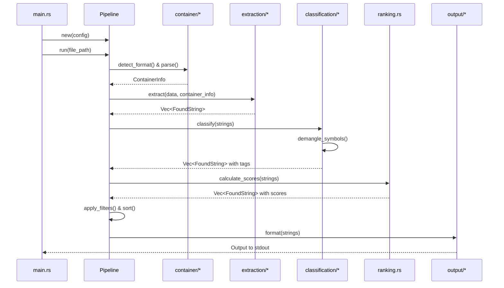

# Technical Plan: Stringy v1.0 Implementation

## Overview

This technical plan defines the architecture for completing Stringy v1.0, building on the existing foundation of format detection, container parsing, and string extraction. The implementation adds semantic classification, intelligent ranking, symbol demangling, flexible output formatting, and CLI orchestration.

## Architectural Approach

### Core Design Decisions

**1. Pipeline Architecture**

The main execution flow will be encapsulated in a `Pipeline` struct that orchestrates the entire analysis process. This provides:

- Clear entry point for the analysis workflow
- Centralized error handling and recovery
- Testability through dependency injection
- Progress tracking integration

**Trade-off**: Struct-based approach adds a layer of abstraction but provides better testability and maintainability compared to functional composition in main().

**2. Enum-Based Output Formatting**

Output formatters will use an enum-based approach with a single format() function that matches on the output type. This provides:

- Simplicity and directness for the 3 required formats
- Easy to understand and maintain
- No trait abstraction overhead
- Sufficient for current requirements

**Trade-off**: Less extensible than trait-based approach, but simpler and more appropriate for the limited number of formatters. Future formats can be added as enum variants.

**3. Memory-Mapped File I/O with Fallback**

File reading will attempt memory mapping first, with automatic fallback to regular file reading on failure. This provides:

- Efficient memory-mapped access for most cases
- Robustness for edge cases (network filesystems, locked files, platform limitations)
- Consistent behavior across all file sizes
- Zero-copy access when possible

**Trade-off**: Slightly more complex than always-on mmap, but handles real-world failure scenarios gracefully.

**4. Modern Regex Caching**

Migrate from `lazy_static` to `once_cell` for regex pattern caching. This provides:

- More modern, ergonomic API
- Better compile-time guarantees
- Consistent with Rust ecosystem trends
- Simpler initialization patterns

**Trade-off**: Requires dependency migration but improves code quality and maintainability.

**5. Rich Progress Feedback**

Use `indicatif` library for progress indicators. This provides:

- Professional progress bars and spinners
- Automatic TTY detection
- Minimal code for rich feedback
- Consistent user experience

**Trade-off**: Adds external dependency but provides significantly better UX than manual eprintln! calls.

### Technical Constraints

**Codebase Standards:**

- No `unsafe` code (`#![forbid(unsafe_code)]` enforced)
- Zero warnings (`cargo clippy -- -D warnings` must pass)
- ASCII-only text (no Unicode punctuation or emojis)
- File size limit: 500 lines per file (split larger files)
- No blanket `#[allow]` attributes

**Module Organization:**

- file:src/classification/ - Semantic analysis and ranking
- file:src/output/ - Output formatters
- file:src/main.rs - CLI and pipeline orchestration
- file:src/lib.rs - Public API and re-exports

**Error Handling:**

- Use `thiserror` for all error types
- Include context (offsets, section names, file paths)
- Graceful degradation where possible
- Clear error messages for user-facing errors

### Integration Strategy

The new components integrate with existing infrastructure:

1. **Classification Integration**: New semantic patterns and symbol demangling extend existing `SemanticClassifier` in file:src/classification/semantic.rs
2. **Ranking Integration**: New `RankingEngine` in src/classification/ranking.rs consumes `FoundString` objects with section weights from container parsers
3. **Output Integration**: New formatters in file:src/output/ consume ranked `Vec<FoundString>` from pipeline
4. **CLI Integration**: file:src/main.rs orchestrates all components through `Pipeline` struct



---

## Data Model

### FoundString Enhancement

Extend the existing `FoundString` struct in file:src/types.rs to include score breakdown for transparency and debugging:

```rust
pub struct FoundString {
    // Existing fields
    pub text: String,
    pub encoding: Encoding,
    pub offset: u64,
    pub rva: Option<u64>,
    pub section: Option<String>,
    pub length: u32,
    pub tags: Vec<Tag>,
    pub score: i32, // Final calculated score
    pub source: StringSource,
    pub confidence: f32,

    // New fields for symbol demangling
    pub original_text: Option<String>, // Original mangled form (if demangled)

    // Optional debug fields (only populated with --debug flag)
    pub section_weight: Option<i32>, // Score from section type
    pub semantic_boost: Option<i32>, // Bonus from semantic tags
    pub noise_penalty: Option<i32>,  // Penalty from noise detection
}
```

**Rationale**:

- `original_text` preserves the mangled symbol for cross-referencing and recovery
- Breakdown fields (section_weight, semantic_boost, noise_penalty) are optional to avoid exposing internal implementation details in the public API
- With --debug flag, breakdown fields are populated for debugging and validation
- Without --debug, breakdown fields remain None, keeping the API simple and flexible

### Ranking Configuration

New configuration struct for ranking parameters in src/classification/ranking.rs:

```rust
pub struct RankingConfig {
    pub section_weights: HashMap<SectionType, i32>,
    pub tag_boosts: HashMap<Tag, i32>,
    pub noise_penalty_config: NoisePenaltyConfig,
}

pub struct NoisePenaltyConfig {
    pub high_entropy_penalty: i32,
    pub excessive_length_penalty: i32,
    pub repeated_pattern_penalty: i32,
}
```

**Integration**: `RankingConfig` uses hardcoded sensible defaults. No user configuration is provided - the defaults are designed to work well across all use cases (malware analysis, reverse engineering, general analysis).

### Filter Configuration

New configuration struct for CLI filtering in file:src/main.rs:

```rust
pub struct FilterConfig {
    pub min_length: Option<usize>,
    pub encodings: Option<Vec<Encoding>>,
    pub include_tags: Option<Vec<Tag>>,
    pub exclude_tags: Option<Vec<Tag>>,
    pub top_n: Option<usize>,
}
```

**Integration**: Built from CLI arguments, passed to Pipeline. Pipeline applies filters after ranking using iterator adapters.

### Output Formatter Interface

Trait definition for output formatters in file:src/output/mod.rs:

```rust
pub enum OutputFormat {
    Table,
    Json,
    Yara,
}

pub struct OutputMetadata {
    pub binary_name: String,
    pub binary_format: BinaryFormat,
    pub total_strings: usize,
    pub filtered_strings: usize,
}

pub fn format_output(
    format: OutputFormat,
    strings: &[FoundString],
    metadata: &OutputMetadata,
) -> Result<String>;
```

**Rationale**: Enum-based design is simpler and more direct for the three required formats. The format_output function matches on the enum and delegates to format-specific logic. Metadata provides context for formatters to include summary information.

### Tag Enum Extensions

Add new variants to existing `Tag` enum in file:src/types.rs with specificity levels:

```rust
pub enum Tag {
    // Existing tags (specific)
    Url,
    Domain,
    IPv4,
    IPv6,
    FilePath,
    RegistryPath,
    Import,
    Export,
    Version,
    Manifest,
    Resource,
    DylibPath,
    Rpath,
    RpathVariable,
    FrameworkPath,

    // New specific tags for v1.0
    Guid,            // GUIDs/UUIDs (specific)
    Email,           // Email addresses (specific)
    FormatString,    // Printf-style format strings (specific)
    UserAgent,       // User agent strings (specific)
    DemangledSymbol, // Demangled Rust/C++ symbols (specific)

    // Broad/ambiguous tags
    Base64, // Base64-encoded data (broad - many false positives)
}
```

**Tag Specificity**: Tags are categorized as specific (high confidence, low false positives) or broad (lower confidence, higher false positives). A string can have multiple tags. Specific tags like Email are prioritized over broad tags like Base64 in display and ranking.

**Integration**: New tags follow existing pattern. Classification logic in file:src/classification/semantic.rs will be extended to detect these patterns. False negatives are worse than false positives - we prefer to tag liberally.

---

## Component Architecture

### 1. Ranking Engine (src/classification/ranking.rs)

**Purpose**: Calculate relevance scores for strings based on multiple factors.

**Interface**:

```rust
pub struct RankingEngine {
    config: RankingConfig,
}

impl RankingEngine {
    pub fn new(config: RankingConfig) -> Self;
    pub fn calculate_score(&self, string: &mut FoundString);
    pub fn rank_strings(&self, strings: &mut [FoundString]);
}
```

**Responsibilities**:

- Apply section weight scoring based on `SectionType`
- Apply semantic boost scoring based on tags
- Calculate noise penalties from confidence scores
- Populate score breakdown fields
- Sort strings by final score

**Integration**: Consumes `FoundString` objects after classification, uses section weights from `ContainerInfo`, applies tag-based boosts.

**File Size**: Keep under 500 lines. If scoring logic exceeds limit, split into src/classification/ranking/mod.rs with submodules for section_weights.rs, semantic_boosts.rs, noise_penalties.rs.

### 2. Symbol Demangling (src/classification/symbols.rs)

**Purpose**: Demangle Rust and C++ symbols to human-readable form while preserving original.

**Interface**:

```rust
pub struct SymbolDemangler {
    // Uses rustc-demangle crate
}

impl SymbolDemangler {
    pub fn new() -> Self;
    pub fn demangle(&self, string: &mut FoundString);
    pub fn is_mangled(&self, symbol: &str) -> bool;
}
```

**Responsibilities**:

- Detect mangled Rust symbols (starts with `_ZN` or `_R`)
- Demangle using `rustc-demangle` crate
- Store original mangled form in `FoundString.original_text`
- Replace `FoundString.text` with demangled version
- Tag demangled symbols with `DemangledSymbol` tag
- Handle demangling failures gracefully (keep original text, no tag)

**Integration**: Called during classification phase. Processes strings with `Import` or `Export` tags. Modifies FoundString in-place, preserving original in original_text field.

**Dependency**: Add `rustc-demangle` to Cargo.toml.

### 3. Semantic Classification Extensions (file:src/classification/semantic.rs)

**Purpose**: Extend existing classifier with new pattern detection.

**New Patterns**:

- **GUID**: Regex for standard GUID format `{XXXXXXXX-XXXX-XXXX-XXXX-XXXXXXXXXXXX}` (specific)
- **Email**: Regex with basic validation ([user@domain.tld](mailto:user@domain.tld)) (specific)
- **Base64**: Pattern detection for Base64-encoded data (length, character set) (broad - many false positives)
- **Format String**: Detection of printf-style format specifiers (%s, %d, %x, etc.) (specific)
- **User Agent**: Pattern matching for common user agent strings (specific)

**Tag Specificity Strategy**:

- Apply all matching patterns - a string can have multiple tags
- Prefer false positives over false negatives (better to tag liberally)
- Specific tags (Email, GUID, FormatString) have higher confidence
- Broad tags (Base64) are applied with lower confidence but still useful
- Tag priority for display handles showing most relevant tags first

**Integration**: Extend existing `SemanticClassifier::classify()` method with new pattern checks. Use `once_cell` for regex caching.

**File Size**: Current file is approaching 500 lines. If additions exceed limit, split into src/classification/semantic/mod.rs with submodules for network.rs, filesystem.rs, identifiers.rs, encoding.rs.

### 4. Output Formatters (file:src/output/)

**Module Structure**:

- file:src/output/mod.rs - OutputFormat enum and format_output() function
- src/output/table.rs - Table formatting logic
- src/output/json.rs - JSONL formatting logic
- src/output/yara.rs - YARA rule generation logic

**Table Formatter** (src/output/table.rs):

- Detect TTY vs non-TTY output using `atty` or `std::io::IsTerminal`
- TTY: Format as aligned table with columns (String | Tags | Score | Section)
- Non-TTY: Output plain strings, one per line
- Handle long strings (show in full, terminal wraps)
- Show primary tags (comma-separated if multiple at same priority)

**JSON Formatter** (src/output/json.rs):

- Output JSONL (one JSON object per line)
- Include all `FoundString` fields (text, encoding, offset, rva, section, length, tags, score, source, confidence)
- Include original_text if present (demangled symbols)
- Include score breakdown fields only if populated (--debug mode)
- Proper escaping for JSON strings via serde_json

**YARA Formatter** (src/output/yara.rs):

- Generate complete YARA rule template
- Sanitize binary filename for rule name (replace non-alphanumeric with underscore, remove extension, add `_strings` suffix)
- Include metadata section (description, tool, date, file hash)
- Escape strings according to YARA syntax (backslashes, quotes, newlines)
- Skip strings over 200 characters with comment: "// Skipped: too long (N chars)"
- Include both `ascii` and `wide` modifiers for compatibility

**Integration**: Pipeline calls format_output() with selected OutputFormat enum variant. The function matches on the enum and delegates to the appropriate formatting module.

### 5. Pipeline Orchestration (file:src/main.rs)

**Purpose**: Coordinate the entire analysis workflow including filtering.

**Structure**:

```rust
pub struct Pipeline {
    config: PipelineConfig,
    progress: ProgressBar, // from indicatif
}

pub struct PipelineConfig {
    extraction_config: ExtractionConfig,
    ranking_config: RankingConfig,
    filter_config: FilterConfig,
    debug_mode: bool,
}

impl Pipeline {
    pub fn new(config: PipelineConfig) -> Self;
    pub fn run(&mut self, file_path: &Path) -> Result<Vec<FoundString>>;
}
```

**Workflow**:

01. Display "Parsing..." progress indicator
02. Attempt memory-map file using `memmap2`, fall back to `std::fs::read()` on failure
03. Detect format and parse container (fail fast on error)
04. Display "Extracting..." progress indicator
05. Extract strings using `BasicExtractor` (fail fast on critical errors)
06. Display "Classifying..." progress indicator
07. Apply semantic classification (graceful degradation - skip failed strings)
08. Apply symbol demangling (graceful degradation - keep original on failure)
09. Display "Ranking..." progress indicator
10. Calculate scores using `RankingEngine` (populate breakdown fields if debug_mode)
11. Apply filters from FilterConfig (min-len, encoding, tags)
12. Sort by score and apply --top limit
13. Format output using selected OutputFormat enum
14. Write to stdout

**Error Handling Strategy**:

*Critical Stages (fail fast):*

- File access: Exit with error if file not found or cannot be read
- Format detection: Exit with error if format unsupported
- Container parsing: Exit with error if binary is corrupted or invalid

*Optional Stages (graceful degradation):*

- Classification: If classification fails on individual strings, skip those strings and continue
- Symbol demangling: If demangling fails, keep original text and continue
- Ranking: If ranking fails, output unranked strings with warning
- Formatting: If primary formatter fails, attempt plain text fallback

*Recovery Strategy*:

- Memory mapping failure: Automatically fall back to regular file reading
- Partial results: If some strings are processed successfully, output them with warning about failures
- No strings found: Display informational message to stderr, exit 0 (not an error)

**Progress Feedback**: Use `indicatif::ProgressBar` with spinner style. Progress messages go to stderr, results to stdout.

**CLI Filtering**: Filter logic is part of `Pipeline::run()` to keep main.rs under 500-line limit:

- Pipeline receives filter configuration from CLI args
- Filters applied after ranking, before output formatting
- Uses iterator adapters: `filter()` for criteria, `take()` for --top
- Filter validation happens during Pipeline initialization

**Integration**: Pipeline owns the entire process including filtering. CLI argument parsing uses `clap` derive macros. Main function is minimal: parse args, create Pipeline, call run(), handle output.

### 6. Performance Optimizations

**Memory Mapping** (file:src/main.rs):

- Attempt `memmap2::Mmap` first for efficient access
- On mmap failure (network filesystem, locked file, platform limitations), fall back to `std::fs::read()`
- Pass byte slice to container parsers (works with both mmap and regular read)
- Log fallback to regular file reading for user awareness

**Regex Caching** (file:src/classification/semantic.rs):

- Migrate from `lazy_static` to `once_cell::sync::Lazy`
- Pre-compile all regex patterns at first use
- Share compiled patterns across all classification calls

**Dependency Additions**:

- `memmap2` - Memory-mapped file I/O with fallback
- `once_cell` - Modern lazy initialization (migrate from lazy_static)
- `indicatif` - Progress bars and spinners
- `rustc-demangle` - Rust symbol demangling
- `atty` or use `std::io::IsTerminal` - TTY detection for output formatting

### Integration Points Summary

| Component          | Consumes                        | Produces                 | Integration Point                               |
| ------------------ | ------------------------------- | ------------------------ | ----------------------------------------------- |
| Pipeline           | CLI args, file path             | Formatted output         | Orchestrates all components + filtering         |
| RankingEngine      | Vec\<FoundString>, debug flag   | Scored Vec\<FoundString> | Called after classification                     |
| SymbolDemangler    | &mut FoundString                | ()                       | Called during classification, modifies in-place |
| SemanticClassifier | FoundString                     | Vec\<Tag>                | Extended with new patterns                      |
| format_output()    | OutputFormat, Vec\<FoundString> | String                   | Enum-based dispatch to formatters               |

### Testing Strategy

**Unit Tests**:

- Ranking: Test score calculation with known inputs
- Symbol demangling: Test with mangled/unmangled symbols
- Semantic patterns: Test each new pattern with positive/negative cases
- Output formatters: Test with sample data, verify format correctness

**Integration Tests**:

- End-to-end pipeline tests with fixture binaries
- CLI argument parsing and filtering
- Output format validation with `insta` snapshots
- Error handling scenarios

**Benchmarks**:

- Ranking performance with large string sets
- Regex pattern matching performance
- Memory mapping vs regular file I/O
- Overall pipeline throughput
